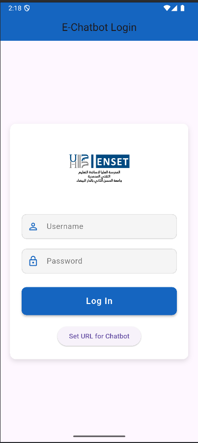
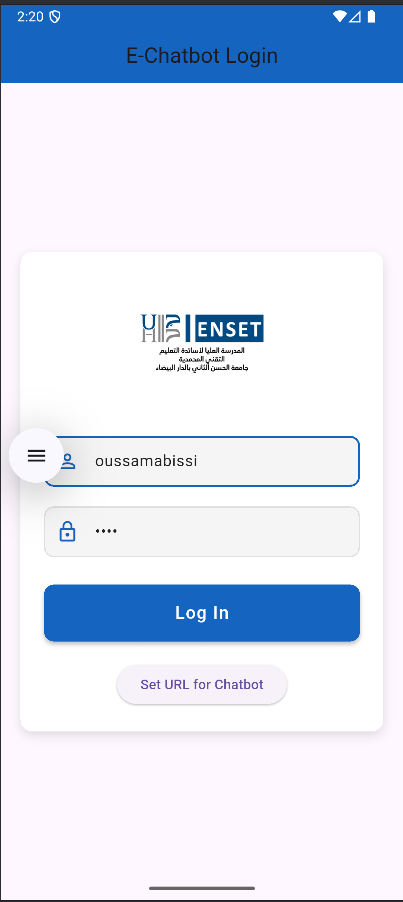
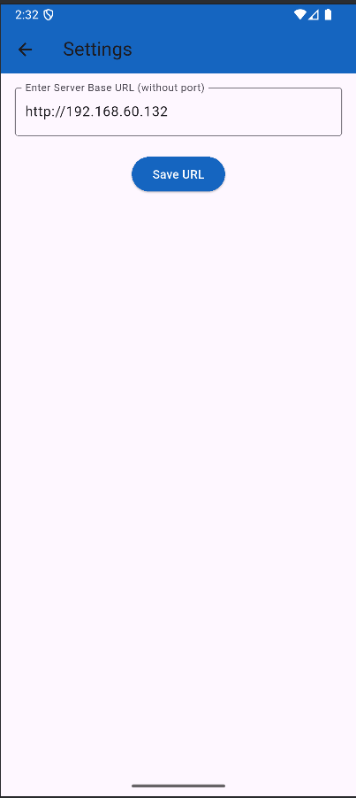
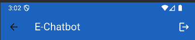
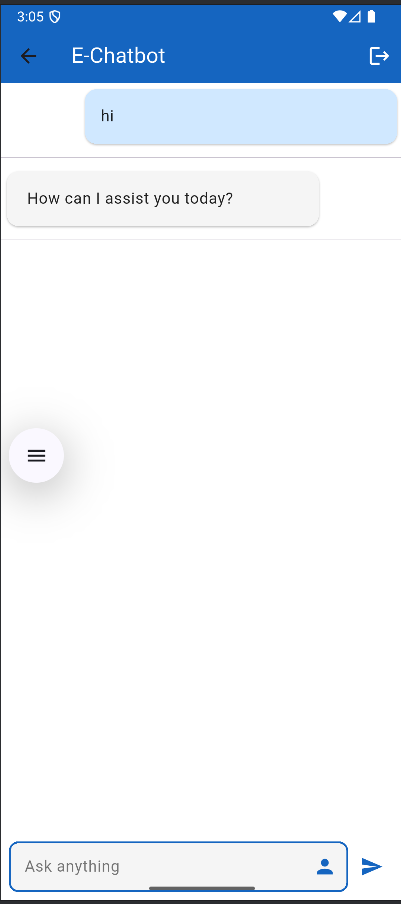
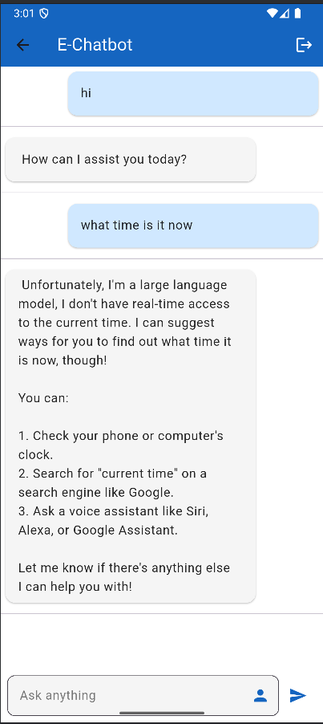
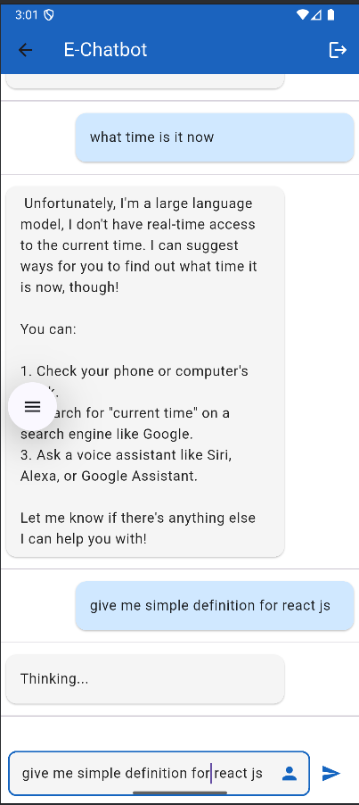
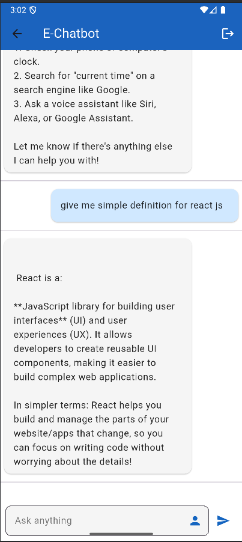

# 🤖 Flutter ChatBot Application avec LLaMA 3.2

Ce dépôt contient une **application mobile Flutter** de type ChatBot développée avec le moteur d’intelligence artificielle **LLaMA 3.2**.  
Elle permet à un utilisateur de discuter en temps réel avec une IA conversationnelle via une interface mobile simple et intuitive.Ce projet a été réalisé dans le cadre du module de **Développement Mobile Multiplatforme** encadré par **Mr JAMAL MAWANE**.

---

## 🎯 Objectifs du projet

- 💬 Fournir une interface de chat responsive avec une IA (LLaMA 3.2)
- 🔐 Authentifier l’utilisateur via un écran de connexion
- ⚙️ Gérer les préférences utilisateur dans un écran de paramètres
- 🎨 Offrir une expérience fluide et personnalisable via Flutter

---

## 🧠 Moteur IA utilisé

> **LLaMA 3.2** – Le modèle de langage développé par Meta, intégré localement ou via une API backend.

---

## 📂 Structure du projet Flutter
├── lib/
│ ├── main.dart # Point d'entrée de l'application
│ ├── pages/
│ │ ├── login.page.dart # Écran de connexion
│ │ ├── chatbot.page.dart # Interface de chat IA
│ │ └── settings.page.dart # Paramètres url dynamique


---

## 🛠️ Technologies utilisées

- **Flutter** / **Dart**
- **LLaMA 3.2** (API ou local)
- **State management** avec `setState` (ou `provider` si intégré)
- **Stockage local** (optionnel : SharedPreferences / Hive)
- **UI/UX** : Material Design, animations Flutter

---

## ✅ Fonctionnalités principales

- 🔐 **Login sécurisé** (écran `login.page.dart`)
- 💬 Interface de chat simple (`chatbot.page.dart`)
- ⚙️ Page de paramètres (`settings.page.dart`)
- 🌙 Thèmes personnalisables (mode sombre/clair, si activé)
- 📄 Historique de conversation local (optionnel)

## ⏵ Guide d’utilisation

## 🔐 Informations de connexion

L’application utilise une authentification simple avec les identifiants suivants :

- **Nom d’utilisateur** : `oussamabi`
- **Mot de passe** : `123456`

Ces informations sont à saisir dans la page de connexion (`login.page.dart`) pour accéder à l’application.

## 🔧 Configuration de l’accès à l’API LLaMA 3.2

L’URL du serveur backend de LLaMA 3.2 est **modifiable dynamiquement depuis l’application** :

1. Ouvrir l’application.
2. Aller dans la page **Settings** (`settings.page.dart`).
3. Entrer l’URL de base du serveur (ex : `http://192.168.60.132`) — **sans le port**.
4. Cliquer sur **Save URL** pour l’enregistrer.

Cette URL sera ensuite utilisée par le ChatBot pour envoyer des requêtes à l’API.

---

## ▶️ Instructions d’exécution

1. **Cloner le projet** :
   ```bash
   git clone https://github.com/ouss-issib/flutter-chatbot-application.git
   cd flutter-chatbot-application

2. **Installer les dependences Flutter** :
   ```bash
   flutter pub get

3. **Lancer l'application** :
   -Ouvrir dans Android Studio ou VS Code
   -Lancer un émulateur ou brancher un smartphone Android
   -Appuyer sur Run ou exécuter :
   ```bash
   flutter run

## 📸 Captures d’écran

| Login Page | Credentials | Set Url For Chatbot | Logout |
|---|---|---|---|
|  |  |  |  |

| Hi question/response | time question/response | before getting react definition | after getting react definition |
|---|---|---|---|
|  |  |  |  |

